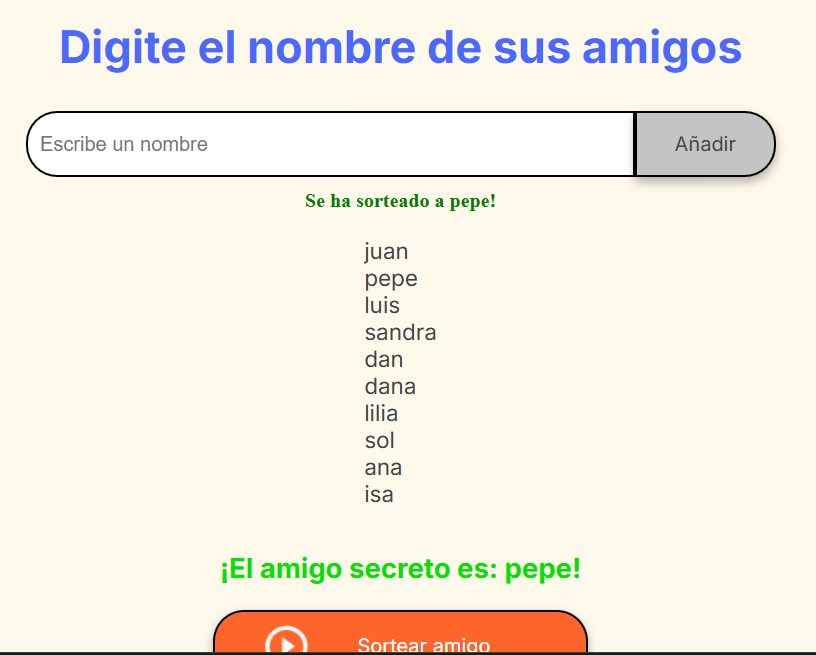
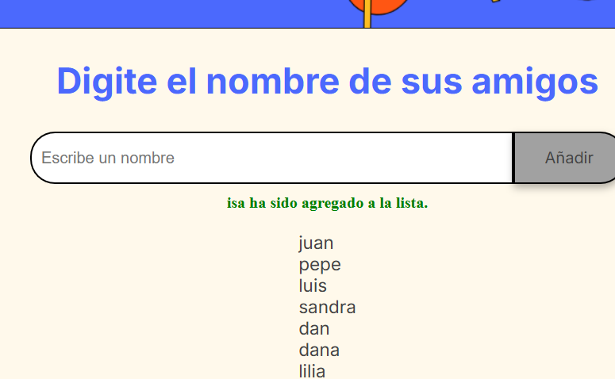
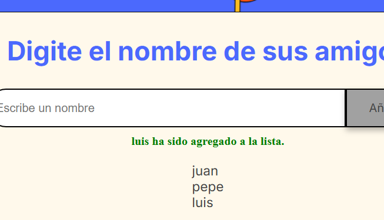

🎁### PROYECTO AMIGO SECRETO
Hola, mi nombre es Isabel Benítez, soy Ingeniera Bioquímica apasionada por la tecnología.

Este proyecto es una aplicación interactiva creada con HTML, CSS y JavaScript, diseñada para organizar un sorteo de amigo secreto de manera fácil y rápida.

Funciones principales
✅ Agregar nombres a la lista de participantes.
✅ Límite de participantes (actualmente 10, pero se puede modificar).
✅ Evitar nombres vacíos o repetidos.
✅ Mostrar mensajes de validación cuando se excede el límite o hay errores.
✅ Realizar el sorteo de forma aleatoria con solo un clic.
✅ Mostrar los resultados del sorteo en pantalla.

Este proyecto es ideal para aprender sobre manipulación del DOM, validaciones y aleatorización en JavaScript.
__________
###SECCIONES DEL PROYECTO
🛠️ Actualización del repositorio mediante Git
🗂️ Creación y manejo de repositorios
🎲 Implementación de un sorteo aleatorio
🔔 Manejo de mensajes y validaciones

  

### CREADO CON:
- HTML
- CSS
- JavaScript

### Vista previa del proyecto
Aquí algunas capturas del proyecto en acción:

### 🎲 Sorteo realizado  
  

### 🔢 Límite de nombres alcanzado  
  

### 🔔 Mensaje cuando se agrega un nombre  
  

### ⚠️ Error al intentar agregar un campo vacío  
  

📩 CONTACTO
[brpisabel@gmail.com](mailto:brpisabelgmail.com)
